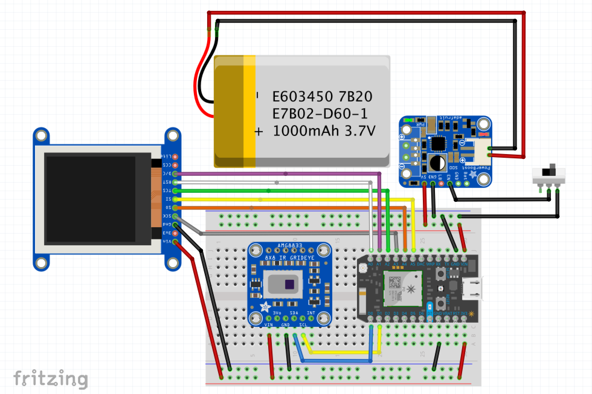
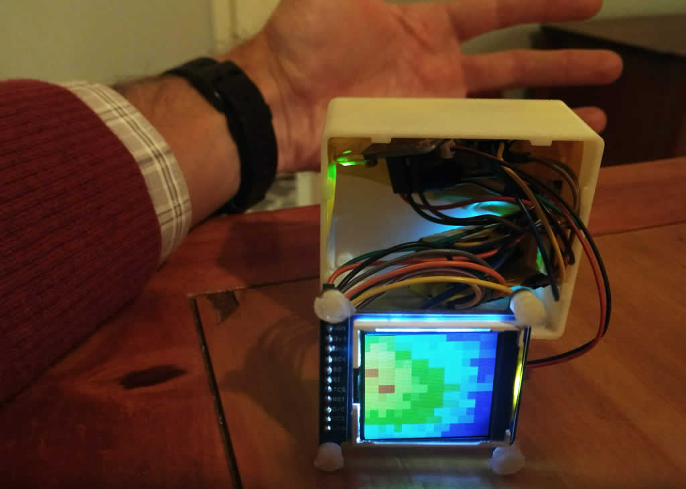

# Low Resolution Thermal Camera (8 by 8 Grid) 

Adafruit [AMG8833 Thermal Camera](https://www.adafruit.com/product/3538) with a [ST7735R 1.44" Color TFT Display](https://www.adafruit.com/product/2088) and a Particle Photon. This low resolution thermal camera can run on a Particle Photon. Using interpolation we can boost the resolution to 16 by 16. The AMG8833 has it's uses but for a little bit more money you can buy the [MLX90640](https://www.sparkfun.com/products/14844) which has a 24 by 32 resolution.

## Parts

> NOTE: The new Particle Argon has built in support for Li-Po batteries but would require an adjustment in wiring. Using this board would decrease the overall cost of the project by $5.

- [1.44" Color TFT Display](https://www.adafruit.com/product/2088) $14.95
- [AMG8833 IR Thermal Camera](https://www.adafruit.com/product/3538) $39.95
- [Particle Photon](https://www.adafruit.com/product/2721) $19.00
- [Li-Po Battery](https://www.adafruit.com/product/1578) $7.95
- [PowerBoost 500 Basic](https://www.adafruit.com/product/1903) $9.95
- [Switch](https://www.adafruit.com/product/805) $0.95
- [Male Headers](https://www.adafruit.com/product/2671)
- [Misc wires](https://www.amazon.com/gp/product/B07DW32WXF/)
- 3D Printed Enclosure (Optional)

**Total Cost: ~$92.00 + Shipping Costs**

## Tools

- Breadboard
- Soldering Iron
- Solder

## Diagram

> **WARNING:** Lithium batteries can catch fire if punctured or used incorrectly. Inspect all wiring and validate against manufactuer data sheets before connecting a battery. If in doubt, power the Photon core directly from a wall charger or battery bank instead. Lithium batteries should only be used if you're comfortable with working with power supplies. **Never charge the battery unattended.**



## Photo



## Sample Output

```JS
[
    24.250000,25.500000,25.250000,25.750000,24.750000,25.500000,25.500000,26.000000,
    21.500000,23.500000,26.000000,25.250000,25.500000,24.500000,25.250000,25.250000,
    21.500000,24.000000,28.500000,25.250000,25.250000,25.750000,25.500000,23.000000,
    22.500000,28.000000,28.250000,24.000000,25.250000,24.500000,21.750000,21.250000,
    24.500000,28.000000,26.250000,20.750000,20.500000,20.250000,19.750000,20.250000,
    22.750000,26.250000,23.500000,20.250000,19.500000,19.500000,20.000000,20.750000,
    21.000000,21.000000,20.250000,20.000000,20.500000,19.750000,19.500000,20.250000,
    20.500000,20.000000,20.750000,19.250000,19.500000,19.750000,20.500000,20.750000
];
```
